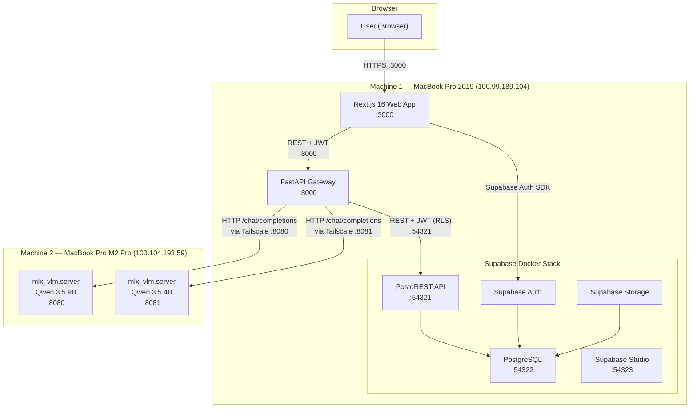
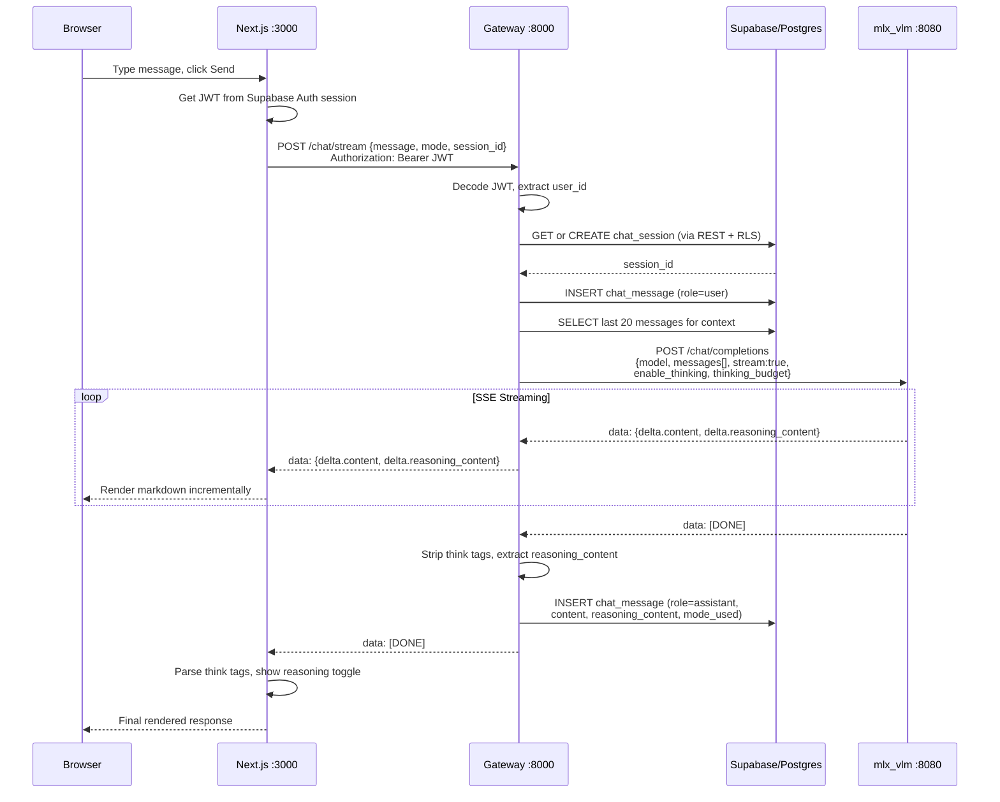
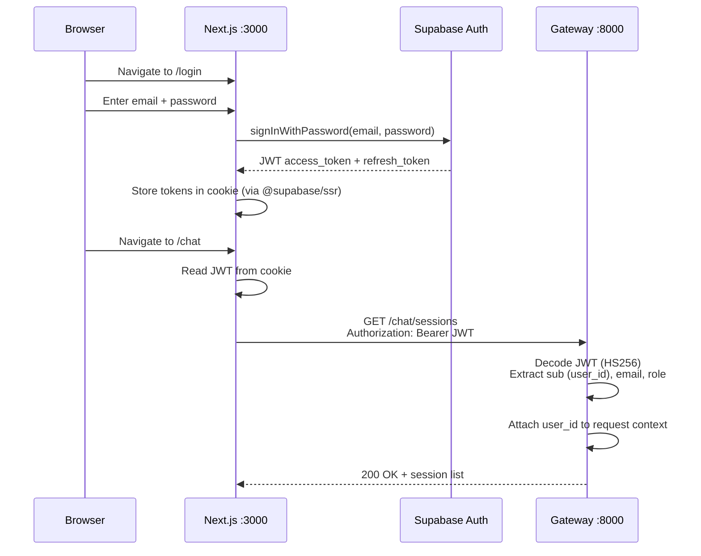
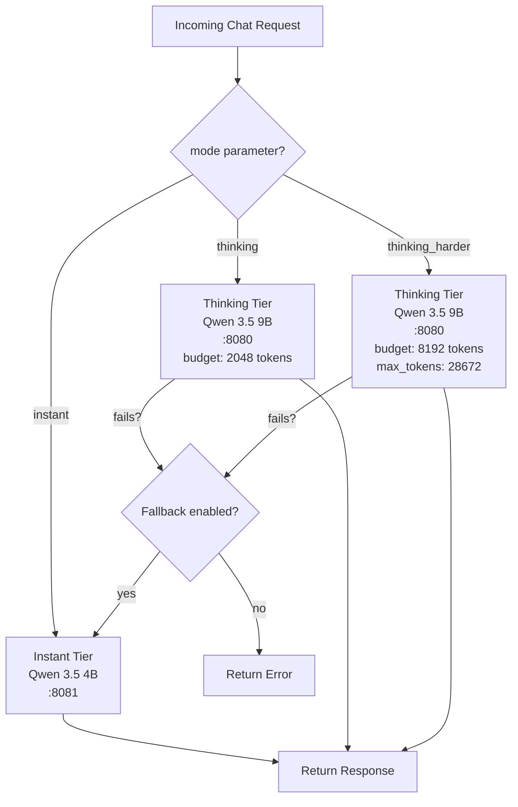
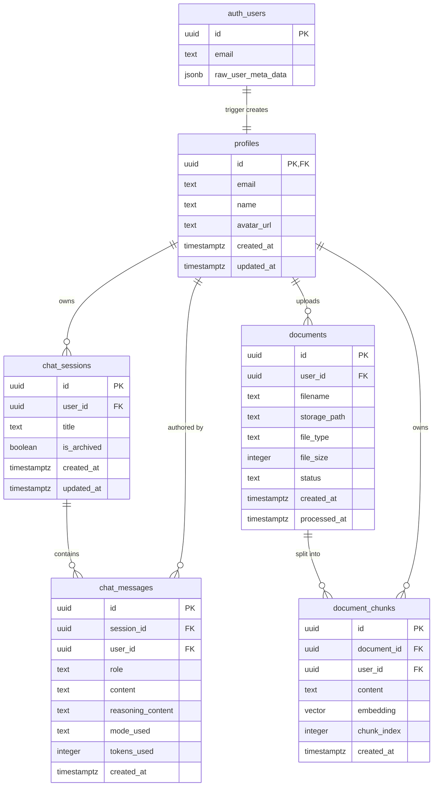
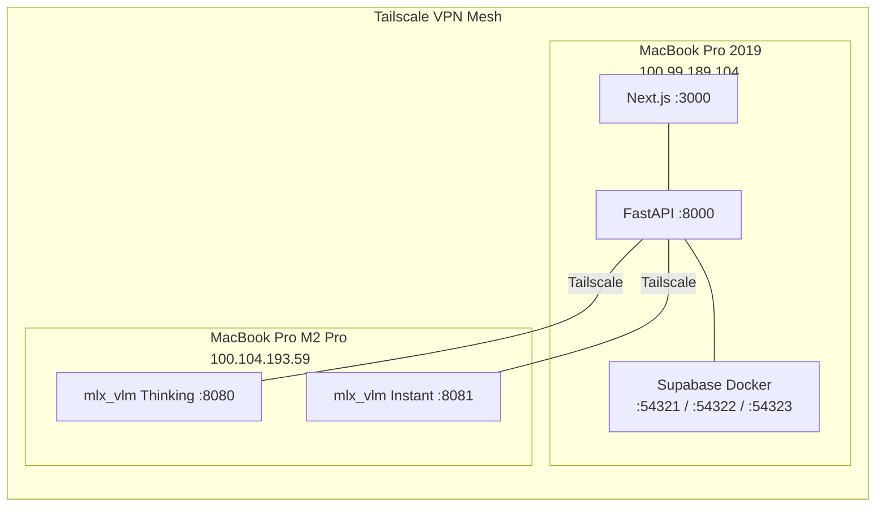
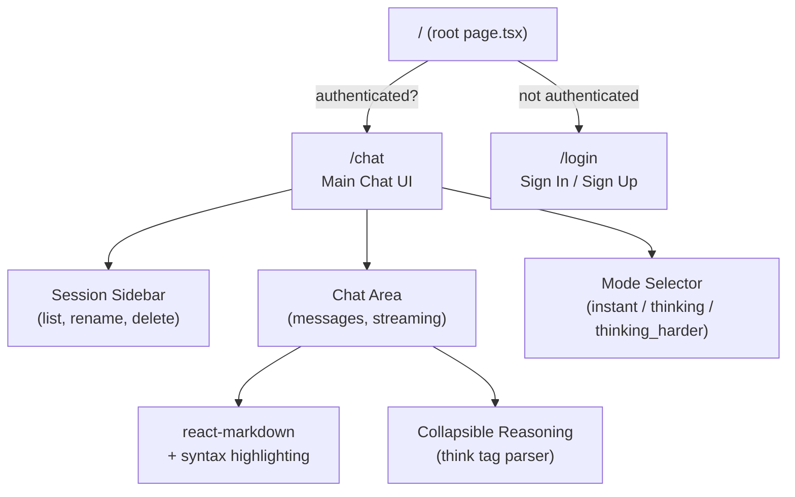

# Full System Architecture Map

Below is the complete infrastructure and architecture of your Local AI Project, broken down into multiple diagrams covering every layer.

---

## 1. High-Level Architecture (All Services)

This is the bird's-eye view of how every component connects:

**Key points:**

- Two physical machines connected via **Tailscale VPN**
- Machine 1 runs the web app, gateway, and entire Supabase stack (via Docker)
- Machine 2 runs the GPU inference servers (Apple Silicon MLX)
- All inter-service communication is HTTP; no message queues or gRPC

---

## 2. Request Flow — Chat Completion (Streaming)

The main user-facing flow when sending a chat message:

---

## 3. Authentication Flow

**Auth details:**

- Supabase Auth issues JWTs (HS256, shared secret)
- Gateway decodes JWT locally (no round-trip to Supabase Auth for validation)
- All Supabase DB queries pass the user JWT for Row-Level Security enforcement
- In dev mode, signature verification is skipped for convenience

---

## 4. Inference Mode Routing

**Cost controls:**

- `THINKING_DAILY_REQUEST_LIMIT` caps heavy inference per day
- `THINKING_MAX_CONCURRENT` limits parallel thinking requests
- Fallback to instant tier is configurable via `ROUTING_THINKING_FALLBACK_TO_INSTANT`

---

## 5. Database Schema (ER Diagram)

**Key schema features:**

- Row-Level Security on every table (users only see their own data)
- `auth.users` trigger auto-creates a `profiles` row on signup
- `chat_messages` trigger auto-updates `chat_sessions.updated_at`
- pgvector extension with IVFFlat index for RAG similarity search (future)
- `mode_used` supports: `instant`, `thinking`, `thinking_harder`

---

## 6. Physical Deployment / Network Topology

---

## 7. Frontend Page Structure

**Frontend stack:** Next.js 16 (App Router), React 19, Tailwind CSS v4, Geist Mono font, dark glass UI theme with green accents. State is managed purely with React hooks (no external state library).

---

## Summary Table

- **Web App** -- Next.js 16, port 3000 -- Chat UI, auth, session management
- **Gateway** -- FastAPI, port 8000 -- Auth middleware, routing, DB proxy, inference proxy, SSE streaming
- **Supabase** -- Docker stack, ports 54321-54323 -- Auth (JWT), PostgreSQL (RLS), Storage (documents bucket)
- **Thinking LLM** -- mlx_vlm.server, port 8080 -- Qwen 3.5 9B with chain-of-thought reasoning
- **Instant LLM** -- mlx_vlm.server, port 8081 -- Qwen 3.5 4B for fast responses
- **Tailscale** -- VPN mesh connecting both machines
- **RAG (future)** -- pgvector + document_chunks table with embedding similarity search

The gateway is the central orchestrator: it authenticates every request, manages sessions/messages in Supabase, routes to the appropriate inference tier, handles streaming, extracts reasoning content, and applies cost controls.